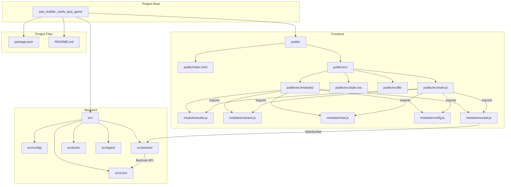

# AWS BuilderCards Quiz Game

## Overview
AWS BuilderCards Quiz Game is a voice-interactive quiz game that combines Amazon Nova Sonic and Nova Lite. In this application, AI reads descriptions of AWS services, and players respond by showing the corresponding AWS BuilderCard to the camera. The system recognizes the card through the camera and determines whether the answer is correct, advancing the game accordingly.


## Acknowledgements
This project was inspired by and references code from [Amazon Nova model cookbook](https://github.com/aws-samples/amazon-nova-samples), which is available under the MIT License.

## Key Features

1. **Voice Interaction**: Natural voice dialogue using Nova Sonic
2. **Card Recognition**: AWS BuilderCards recognition using Nova Lite
3. **Quiz Game**: AWS service descriptions and answer validation
4. **Automatic Photo Capture**: Automatically takes photos when specific phrases like "I found it" are detected
5. **Multiple Camera Support**: Ability to switch between cameras if multiple are available

## Technology Stack

- **Frontend**: HTML/JavaScript/CSS
- **Backend**: Node.js/Express
- **AWS Services**: Bedrock (Nova Sonic, Nova Lite)
- **Communication**: WebSocket (Socket.IO)
- **Image Processing**: WebRTC API

## How to Use

1. Click the "Start Camera" button to activate the camera
2. Click the "Start Streaming" button to begin voice interaction
3. Say "Let's start" to begin the quiz
4. The AI will read a description of an AWS service (without naming it)
5. When you find the corresponding AWS BuilderCard, say "I found it" and show it to the camera
6. The system will automatically take a photo and recognize the AWS service displayed on the card
7. The AI will determine if your answer is correct or incorrect
8. Say "Next question" to proceed to the next question

## Developer Information

### Prerequisites
- Node.js (v14 or higher)
- AWS Account (with Bedrock access)
- AWS CLI (configured)
- AWS BuilderCards

### Installation
```bash
git clone https://github.com/moritalous/aws_builder_cards_quiz_game.git
cd aws_builder_cards_quiz_game
npm install
```

### Environment Variables
```
export AWS_PROFILE=<your-profile>
export AWS_REGION=us-east-1
```

### Execution
```bash
npm run dev
```

Access http://localhost:3000 in your browser.

## Project Structure
```
.
├── public/                 # Frontend files
│   ├── index.html         # Main HTML
│   └── src/               # Frontend source code
│       ├── lib/           # Utility libraries
│       ├── modules/       # Frontend modules
│       ├── main.js        # Main application logic
│       └── style.css      # Style definitions
├── src/                   # Backend source code
│   ├── config/           # Configuration files
│   ├── core/             # Core functionality
│   ├── stream/           # Streaming components
│   ├── tools/            # Tool implementations
│   └── types/            # Type definitions
└── package.json          # Dependencies
```

### Architecture Diagram


### Data Flow
1. The frontend's main.js integrates various modules
2. socket.js establishes WebSocket communication with the backend
3. Backend stream/ components interact with Bedrock API for Nova Sonic and Nova Lite
4. User voice input and image recognition results are processed in real-time

## Detailed Feature Information

### Voice Interaction
- Real-time voice streaming via WebSocket
- Natural dialogue using voice recognition and synthesis
- Automatic actions triggered by specific phrases like "I found it"

### Card Recognition
- Image recognition using Nova Lite
- AWS service identification from AWS BuilderCards
- Automatic photo capture feature (toggleable)

### Quiz Game
- Questions drawn from 32 different AWS services
- Finding the corresponding card based on service descriptions
- Correct/incorrect answer validation and progression to the next question

### UI Features
- Chat display toggle
- Camera selection and switching
- Automatic capture enable/disable toggle

## Future Expansion Plans
- Adding difficulty levels
- Multiplayer mode
- Leaderboard functionality
- Adding more AWS services
- Learning mode (detailed explanations and use cases)